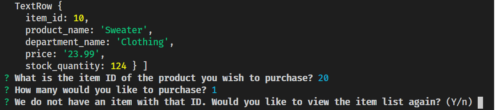
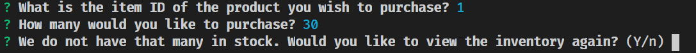
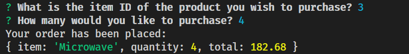

# Bamazon
#### CLI App for an Amazon-inspired storefront simulator

Intro

This application uses a database built from MySQL to store information on an inventory for Bamazon! Each item has an ID, name, price, and quantity in-stock.

The app itself is in Node, and uses inquirer to prompt user inputs.

The user is prompted for both an item ID number and quantity desired for ordering. Should the user provide an ID number that isn't listed, the app will mention so and prompt if the user needs to see the items again.

If the user provides a quantity that is beyond the number of items in stock, the app will reject the user's order.

Should the order go through with a valid item ID and appropriate order amount, the database will update to reflect the change in item stock;in addition, the receipt will show up in the terminal.

